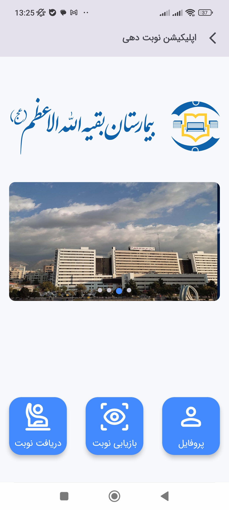
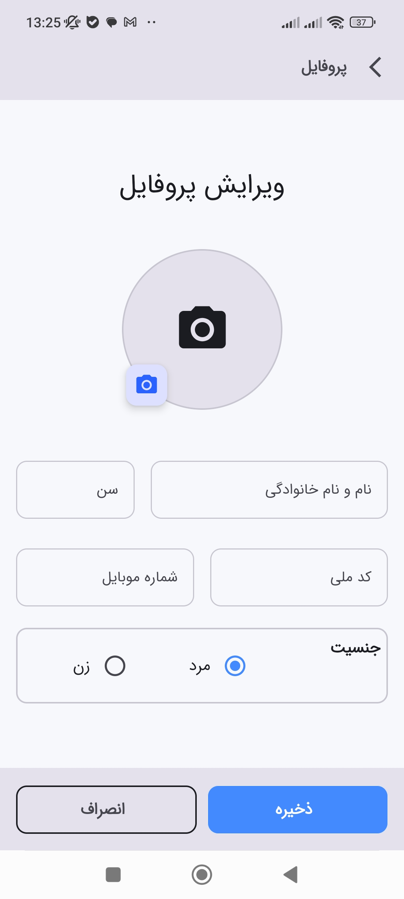
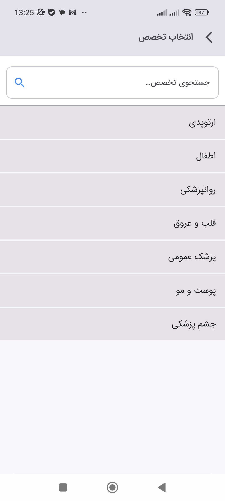
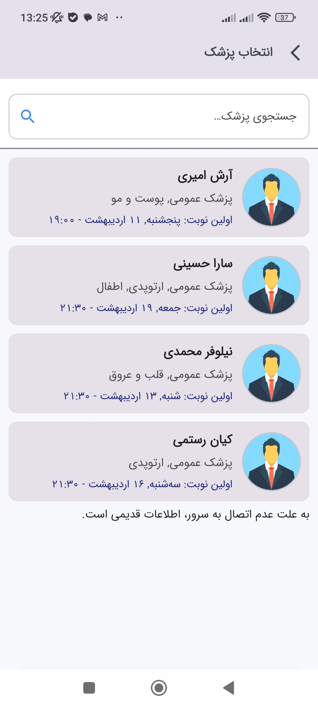
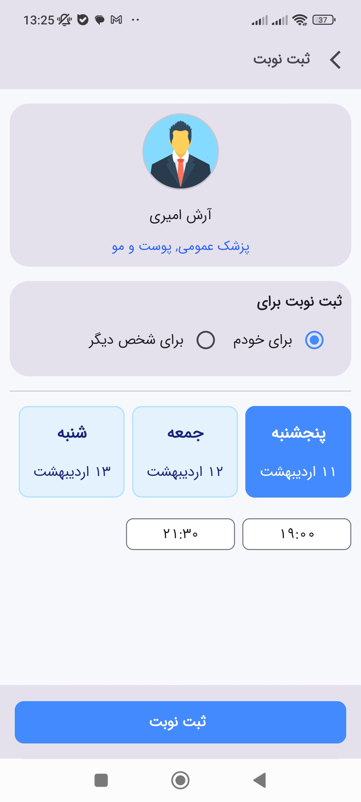
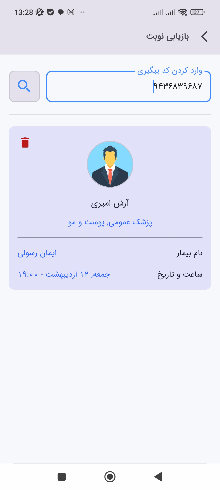

# Appointment App

A modular Android appointment management app built with Kotlin and Jetpack Compose.  
The app is designed for managing doctors, specialties, patients, profiles, time slots, and appointments with an offline-first approach and periodic synchronization.

---

## Features

- Browse doctors
- Browse specialties
- Create appointments
- Find appointments by tracking code
- Manage patient profile
- Offline-first local storage with sync support
- Periodic background synchronization
- Modular navigation with Compose
- RTL layout support

---

## Tech Stack

- **Language:** Kotlin
- **UI:** Jetpack Compose
- **Architecture:** Modular, layered, MVI-style
- **Dependency Injection:** Hilt
- **Local Database:** Room
- **Remote API:** Retrofit + OkHttp + Gson
- **Background Sync:** WorkManager-based sync layer
- **Build System:** Gradle Kotlin DSL

---

## Project Structure

The project is organized into multiple modules:

- `app` – main application entry point and navigation
- `core/common` – shared models, MVI primitives, utilities
- `core/database` – Room database, entities, DAO, converters
- `core/network` – Retrofit APIs, DTOs, network configuration
- `core/sync` – sync manager, worker, file manager
- `core/ui` – shared UI components, theme, navigation helpers
- `feature/appointment` – appointment-related screens, view models, repository, sync
- `feature/doctor` – doctor browsing and data layer
- `feature/profile` – profile management
- `feature/specialty` – specialty browsing

---

## Screenshots

| Home Screen | Profile |
| :---: | :---: |
|  |  |

| Specialty | Doctor List |
| :---: | :---: |
|  |  |

| Doctor | Recovery Appointment |
| :---: | :---: |
|  |  |

